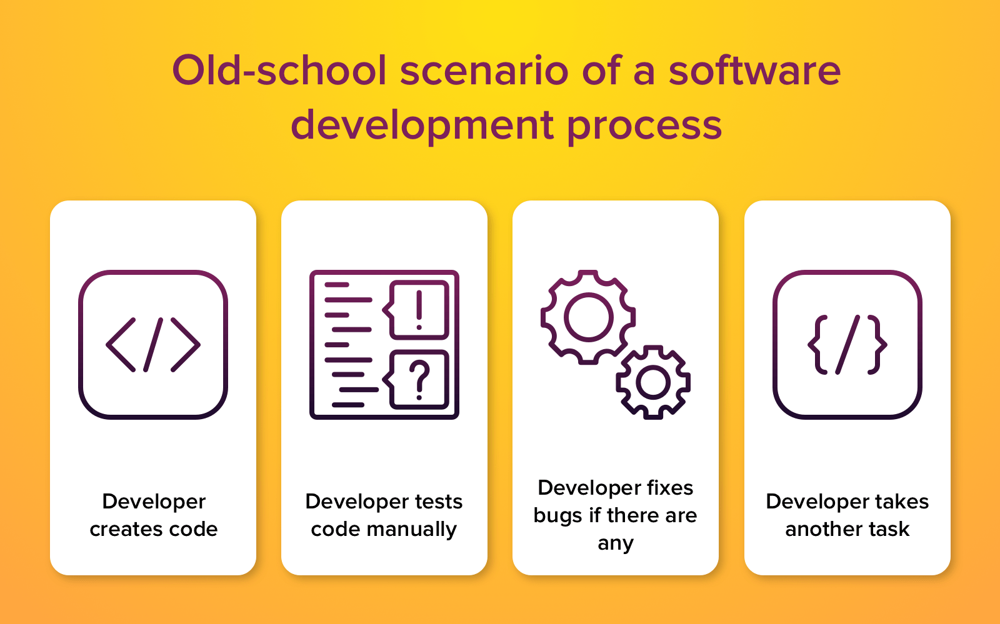

# 1. Continuous integration and its benefit that can improve the productivity and competitiveness of a company.
## 1.1 what is continuous integration

Continuous integration (CI) is the practice of automating the integration of code changes from multiple contributors into a single software project. The CI process is comprised of automatic tools that assert the new code’s correctness before integration. A source code version control system is the crux of the CI process. The version control system is also supplemented with other checks like automated code quality tests, syntax style review tools, and more. 
Software development process differs from any other manufactures and you have to understand that bugs are an essential part here. Still, continuous integration best practices create a new philosophy to deal with them. Before CI, each developer on a project created his part, tested it and only then committed. Despite a fact that each piece of code worked seamlessly, the project itself had lots of bugs after building and was more like a puzzle which consists of many separate parts. The old system suggested developers create software following these four stages:  

  

The old approach is not only imperfect, it had no chances to become successful. While the best continuous integration tools change the rules of the game. Applying CI, developers don't need to rely on others. They can be sure that the code will work smoothly even if all the variables change. How does continuous integration work? The approach depends on three main continuous integration principles:

## 1.2 Benefit of continuous integration for companies.
* Smaller Code Changes:
One technical advantage of continuous integration and continuous delivery is that it allows you to integrate small pieces of code at one time. These code changes are simpler and easier to handle than huge chunks of code and as such, have fewer issues that may need to be repaired at a later date. Using continuous testing, these small pieces can be tested as soon as they are integrated into the code repository, allowing developers to recognize a problem before too much work is completed afterward. This works really well for large development teams who work remotely as well as those in-house as communication between team members can be challenging.

* Fault Isolations: Fault isolation refers to the practice of designing systems such that when an error occurs, the negative outcomes are limited in scope. Limiting the scope of problems reduces the potential for damage and makes systems easier to maintain. Designing your system with CI/CD ensures that fault isolations are faster to detect and easier to implement. Fault isolations combine monitoring the system, identifying when the fault occurred, and triggering its location. Thus, the consequences of bugs appearing in the application are limited in scope. Sudden breakdowns and other critical issues can be prevented from occurring with the ability to isolate the problem before it can cause damage to the entire system.

* Faster Mean Time To Resolution: measures the maintainability of repairable features and sets the average time to repair a broken feature. Basically, it helps you track the amount of time spent to recover from a failure. CI/CD reduces the MTTR because the code changes are smaller and fault isolations are easier to detect. One of the most important business risk assurances is to keep failures to a minimum and quickly recover from any failures that do happen. Application monitoring tools are a great way to find and fix failures while also logging the problems to notice trends faster.

* More Test Reliability: Using CI/CD, test reliability improves due to the bite-size and specific changes introduced to the system, allowing for more accurate positive and negative tests to be conducted. Test reliability within CI/CD can also be considered Continuous Reliability. With the continuous merging and releasing of new products and features, knowing that quality was top of mind throughout the entire process assures stakeholders their investment is worthwhile.

* Faster Release Rate: Failures are detected faster and as such, can be repaired faster, leading to increasing release rates. However, frequent releases are possible only if the code is developed in a continuously moving system. CI/CD continuously merges codes and continuously deploys them to production after thorough testing, keeping the code in a release-ready state. It’s important to have as part of deployment a production environment set up that closely mimics that which end-users will ultimately be using. Containerization is a great method to test the code in a production environment to test only the area that will be affected by the release.

* Customer Satisfaction: The advantages of CI/CD do not only fall into the technical aspect but also in an organization scope. The first few moments of a new customer trying out your product is a make-or-break-it moment. Don’t waste first impressions as they are key to turning new customers into satisfied customers. Keep your customers happy with fast turnaround of new features and bug fixes. Utilizing a CI/CD approach also keeps your product up-to-date with the latest technology and allows you to gain new customers who will select you over the competition through word-of-mouth and positive reviews.
Your customers are the main users of your product. As such, what they have to say should be taken into high consideration. Whether the comments are positive or negative, customer feedback and involvement leads to usability improvements and overall customer satisfaction.
Your customers want to know they are being heard. Adding new features and changes into your CI/CD pipeline based on the way your customers use the product will help you retain current users and gain new ones.

* Increase Team Transparency and Accountability: CI/CD is a great way to get continuous feedback not only from your customers but also from your own team. This increases the transparency of any problems in the team and encourages responsible accountability.
CI is mostly focused on the development team, so the feedback from this part of the pipeline affects build failures, merging problems, architectural setbacks, etc. CD focuses more on getting the product quickly to the end-users to get the much-needed customer feedback. Both CI and CD provide rapid feedback, allowing you to steadily and continuously make your product even better.

## 2. Reference
* [Top 10 Benefits of Continuous Integration & Continuous Delivery](https://www.katalon.com/resources-center/blog/benefits-continuous-integration-delivery/)
* [What is Continuous Integration](https://www.atlassian.com/continuous-delivery/continuous-integration)
