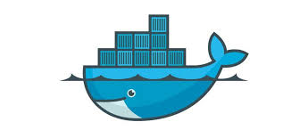

# 1. Docker and its benefit that can improve the productivity and competitiveness of a company.
## 1.1 What is Docker?
Docker is an open-source software for deployment and development of applications within containers. Containers allow developers to emulate applications regardless of the OS and programming language, across multiple computers.

Containers are portable and can be run both in the cloud or on a machine with Docker installed, which makes using Docker in developing very flexible. We live and breathe flexibility here at Polcode.
### 1.2 Why we use docker?
Docker requires fewer infrastructure resources and doesn’t need installation of various language environments on a local machine to work. Both these traits make developing in Docker faster and more organized.

When developing in Docker, devs can assign and distribute resources to certain containers with applications. This reduces downtime and keeps performance at a decent level.

If there is no need to install different environments along with their configuration, developers don’t have to go through the trouble of preparing their computers for every programming language.

We also use Docker because it makes deployment easier. The general rule is that, if the application works in a container, it will work when sent to the server, as well. So when you sent your app with a respective Docker image, there’s no need to worry that it won’t run properly.

## 1.3 How docker improve the productivity and competitiveness of a company

For software development firms, there are many benefits of using Docker. Firstly, the flexibility offered by Docker containers means that engineers can focus on delivering a product to their customers. Rather than spending time on compatibility issues and different programming languages, they can instead focus on innovative new features, improving the user interface and correcting coding flaws.

Software companies can also rest easy that their application will deliver a consistent performance regardless of the infrastructure being used by the host device. Normally, developers would have to manage several different dependencies and configurations for each environment, but with Docker that’s no longer necessary.

As a result, Docker has enabled businesses to ship software at a much faster rate than was previously possible. Docker containers can also be scaled up or down, depending on demand in just seconds, meaning that resources are used more efficiently. When it comes to serving updates and patches, Docker containers also offer ease-of-use.

Problem containers can be isolated and engineers can roll back to the relevant stage in the software development cycle, make the required changes and push the upgraded container back into action. The isolation provided by each container means that making these changes causes far less disruption to other software compared to other development approaches.

This has enabled a faster and more dynamic approach to software creation -- in fact, recent research suggests that Docker accelerates application delivery by as much as 600 percent.

For businesses that use a lot of software packages, Docker also has its advantages. As well the portability that containers provide, companies will discover that they no longer need a separate virtual machine for each application that they’re using. This can greatly reduce the amount of processing power required, giving businesses the freedom to embrace more applications or simply streamline their operations.

## 2. Reference
* [What Is Docker and How Does It Help Company Organization?](https://polcode.com/blog/what-is-docker-and-how-does-it-help-company-organization/)  
* [Docker: The business benefits](https://betanews.com/2015/12/10/docker-the-business-benefits/)
