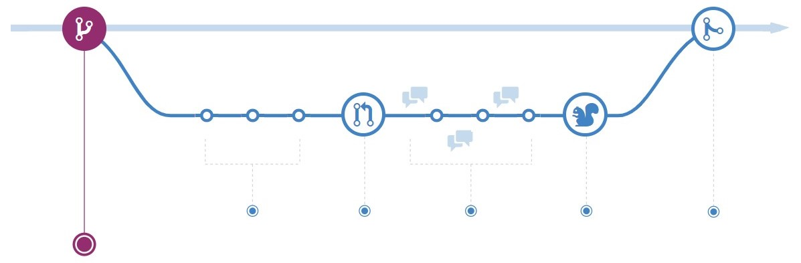
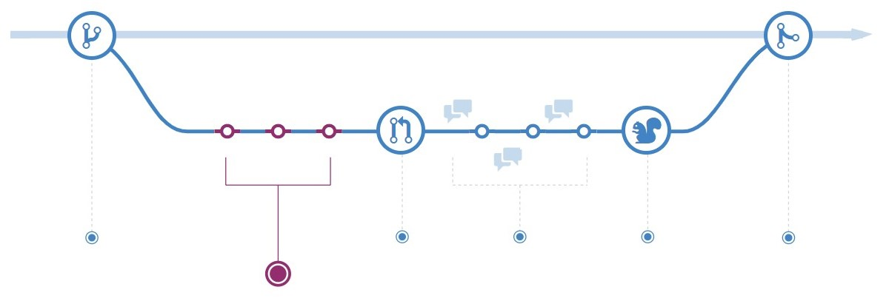
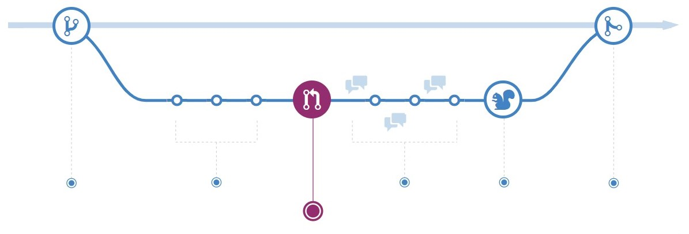
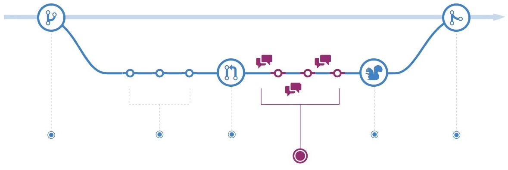
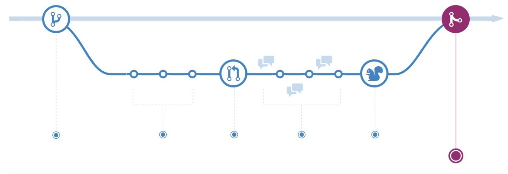

# Git workflow

## 1. Create a branch
When you're working on a project, you're going to have a bunch of different features or ideas in progress at any given time – some of which are ready to go, and others which are not. Branching exists to help you manage this workflow.  
  

When you create a branch in your project, you're creating an environment where you can try out new ideas. Changes you make on a branch don't affect the main branch, so you're free to experiment and commit changes, safe in the knowledge that your branch won't be merged until it's ready to be reviewed by someone you're collaborating with.

## 2. Add commits

Once your branch has been created, it's time to start making changes. Whenever you add, edit, or delete a file, you're making a commit, and adding them to your branch. This process of adding commits keeps track of your progress as you work on a feature branch.

Commits also create a transparent history of your work that others can follow to understand what you've done and why. Each commit has an associated commit message, which is a description explaining why a particular change was made. Furthermore, each commit is considered a separate unit of change. This lets you roll back changes if a bug is found, or if you decide to head in a different direction.

## 3. Open a Pull Request

Pull Requests initiate discussion about your commits. Because they're tightly integrated with the underlying Git repository, anyone can see exactly what changes would be merged if they accept your request.  

  

You can open a Pull Request at any point during the development process: when you have little or no code but want to share some screenshots or general ideas, when you're stuck and need help or advice, or when you're ready for someone to review your work. By using GitHub's @mention system in your Pull Request message, you can ask for feedback from specific people or teams, whether they're down the hall or ten time zones away.

## 4. Discuss and review your code
Once a Pull Request has been opened, the person or team reviewing your changes may have questions or comments. Perhaps the coding style doesn't match project guidelines, the change is missing unit tests, or maybe everything looks great and props are in order. Pull Requests are designed to encourage and capture this type of conversation.  

You can also continue to push to your branch in light of discussion and feedback about your commits. If someone comments that you forgot to do something or if there is a bug in the code, you can fix it in your branch and push up the change. GitHub will show your new commits and any additional feedback you may receive in the unified Pull Request view.

## 5. Merge
Now that your changes have been verified in production, it is time to merge your code into the main branch.  

Once merged, Pull Requests preserve a record of the historical changes to your code. Because they're searchable, they let anyone go back in time to understand why and how a decision was made.

## Reference
* [Understand the git workflow](Understanding the GitHub flow)
