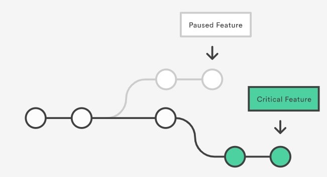

# IS601-MiniTeam1
This is the repository for the IS601 First Mini Team project.   

Team member:  
* Khang Tran
* Sahaj Vaidya  

In this project we will explain how the usage of Git, Docker, automated testing,
and continuous integration can improve the productivity and competitiveness of a company.

## 1. Git 

Git is a free and open source distributed version control system 
designed to handle everything from small to very large projects with 
speed and efficiency. Git’s purpose is to keep track of projects and files as they change over time with manipulations happening from different users. Git stores information about the project’s progress on a repository. 
A repository has commits to the project or a set of references to the commits called heads. 
All this information is stored in the same folder as the project in a sub-folder called .git and will mostly be hidden by default in most systems.  
So basically. Git keeps track of the changes a couple of people make on a single project and then merges the code where people have worked on different parts into one project. 
This way, when someone introduces a bug, you can track down the code that introduced the bug by going through the commits.

## 2. The Advantages of Git that can improve the productivity and competitiveness of a company.
### 2.1 Git for developers
#### 2.1.1 Branching
One of the biggest advantages of Git is its branching capabilities.
Feature branches provide an isolated environment for every change to your codebase.
When a developer wants to start working on something—no matter how big or small—they create a new branch. 
This ensures that the master branch always contains production-quality code.  
  
  

Using feature branches is not only more reliable than directly editing production code, 
but it also provides organizational benefits. 
They let you represent development work at the same granularity as the your agile backlog. 

#### 2.1.2 Distributed Development
Git is a distributed version control system. 
Instead of a working copy, each developer gets their own local repository, complete with a full history of commits.  
  
  
  
  
Having a full local history makes Git fast, since it means you don’t need a network connection to create commits, inspect previous versions of a file, or perform diffs between commits.
Distributed development also makes it easier to scale your engineering team. If someone breaks the production branch in SVN, other developers can’t check in their changes until it’s fixed. With Git, this kind of blocking doesn’t exist. Everybody can continue going about their business in their own local repositories.
And, similar to feature branches, distributed development creates a more reliable environment. Even if a developer obliterates their own repository, they can simply clone someone else’s and start anew.

#### 2.1.3 Pull Request
A pull request is a way to ask another developer to merge one of your branches into their repository. This not only makes it easier for project leads to keep track of changes, but also lets developers initiate discussions around their work before integrating it with the rest of the codebase.
Since they’re essentially a comment thread attached to a feature branch, pull requests are extremely versatile. When a developer gets stuck with a hard problem, they can open a pull request to ask for help from the rest of the team. Alternatively, junior developers can be confident that they aren’t destroying the entire project by treating pull requests as a formal code review.  
   
  
#### 2.1.4 Community
In many circles, Git has come to be the expected version control system for new projects. If your team is using Git, odds are you won’t have to train new hires on your workflow, because they’ll already be familiar with distributed development.
In addition, Git is very popular among open source projects. This means it’s easy to leverage 3rd-party libraries and encourage others to fork your own open source code.  
  

#### 2.1.5 Faster Release Cycle
The ultimate result of feature branches, distributed development, pull requests, and a stable community is a faster release cycle. These capabilities facilitate an agile workflow where developers are encouraged to share smaller changes more frequently. In turn, changes can get pushed down the deployment pipeline faster than the monolithic releases common with centralized version control systems.
As you might expect, Git works very well with continuous integration and continuous delivery environments. Git hooks allow you to run scripts when certain events occur inside of a repository, which lets you automate deployment to your heart’s content. You can even build or deploy code from specific branches to different servers.  
  

### 2.2 Git for Marketing
The shorter development cycle facilitated by Git makes it much easier to divide marketing task into individual releases. 
This gives marketers more to talk about, more often. In the above scenario, marketing can build out three campaigns that revolve around each feature, and thus target very specific market segments.  
  
  
For instance, they might prepare a big PR push for the game changing feature, a corporate blog post and newsletter blurb for Mary’s feature, and some guest posts about Rick’s underlying UX theory for sending to external design blogs. All of these activities can be synchronized with a separate release.  

### 2.3 Git for product management
The benefits of Git for product management is much the same as for marketing. More frequent releases means more frequent customer feedback and faster updates in reaction to that feedback. Instead of waiting for the next release 8 weeks from now, you can push a solution out to customers as quickly as your developers can write the code.  
  
    

The feature branch workflow also provides flexibility when priorities change. For instance, if you’re halfway through a release cycle and you want to postpone one feature in lieu of another time-critical one, it’s no problem. That initial feature can sit around in its own branch until engineering has time to come back to it. This same functionality makes it easy to manage innovation projects, beta tests, and rapid prototypes as independent codebases.

### 2.4 Git for Customer Services
Customer support and customer success often have a different take on updates than product managers. When a customer calls them up, they’re usually experiencing some kind of problem. If that problem is caused by your company’s software, a bug fix needs to be pushed out as soon as possible.

Git’s streamlined development cycle avoids postponing bug fixes until the next monolithic release. A developer can patch the problem and push it directly to production. Faster fixes means happier customers and fewer repeat support tickets. Instead of being stuck with, “Sorry, we’ll get right on that” your customer support team can start responding with “We’ve already fixed it!

## 3. Docker and its benefit that can improve the productivity and competitiveness of a company.
### 3.1 What is Docker?
Docker is an open-source software for deployment and development of applications within containers. Containers allow developers to emulate applications regardless of the OS and programming language, across multiple computers.

Containers are portable and can be run both in the cloud or on a machine with Docker installed, which makes using Docker in developing very flexible. We live and breathe flexibility here at Polcode.
### 3.2 Why we use docker?
Docker requires fewer infrastructure resources and doesn’t need installation of various language environments on a local machine to work. Both these traits make developing in Docker faster and more organized.

When developing in Docker, devs can assign and distribute resources to certain containers with applications. This reduces downtime and keeps performance at a decent level.

If there is no need to install different environments along with their configuration, developers don’t have to go through the trouble of preparing their computers for every programming language.

We also use Docker because it makes deployment easier. The general rule is that, if the application works in a container, it will work when sent to the server, as well. So when you sent your app with a respective Docker image, there’s no need to worry that it won’t run properly.

### How docker improve the productivity and competitiveness of a company

For software development firms, there are many benefits of using Docker. Firstly, the flexibility offered by Docker containers means that engineers can focus on delivering a product to their customers. Rather than spending time on compatibility issues and different programming languages, they can instead focus on innovative new features, improving the user interface and correcting coding flaws.

Software companies can also rest easy that their application will deliver a consistent performance regardless of the infrastructure being used by the host device. Normally, developers would have to manage several different dependencies and configurations for each environment, but with Docker that’s no longer necessary.

As a result, Docker has enabled businesses to ship software at a much faster rate than was previously possible. Docker containers can also be scaled up or down, depending on demand in just seconds, meaning that resources are used more efficiently. When it comes to serving updates and patches, Docker containers also offer ease-of-use.

Problem containers can be isolated and engineers can roll back to the relevant stage in the software development cycle, make the required changes and push the upgraded container back into action. The isolation provided by each container means that making these changes causes far less disruption to other software compared to other development approaches.

This has enabled a faster and more dynamic approach to software creation -- in fact, recent research suggests that Docker accelerates application delivery by as much as 600 percent.

For businesses that use a lot of software packages, Docker also has its advantages. As well the portability that containers provide, companies will discover that they no longer need a separate virtual machine for each application that they’re using. This can greatly reduce the amount of processing power required, giving businesses the freedom to embrace more applications or simply streamline their operations.

## 4. Automated testing and its benefit that can improve the productivity and competitiveness of a company.
Automated testing is, well, automated. This differs from manual testing where a human being is responsible for single-handedly testing the functionality of the software in the way a user would. Because automated testing is done through an automation tool, less time is needed in exploratory tests and more time is needed in maintaining test scripts while increasing overall test coverage.

The benefit of manual testing is that it allows a human mind to draw insights from a test that might otherwise be missed by an automated testing program. Automated testing is well-suited for large projects; projects that require testing the same areas over and over; and projects that have already been through an initial manual testing process.

## 5. Continuous integration and its benefit that can improve the productivity and competitiveness of a company.

## 6. Git Commands and Terminology

### 6.1 Git Clone
This command is used to get a copy of an already existing Git repository. Cloning can be considered as a process of creating an identical copy of Git repository to the local system.
When we clone a repository, all the files are downloaded to local machine, but the remote repository remains unchanged. Editing the local repository and committing changes does not have an impact on the remote version in any way.
However, these changes can be synced with the remote repository anytime the user wants.
Cloning is required for organizations where mulitple people work on the same code base.
By cloning, people can modify the project code or suggest some edits. This helps to achieve greater efficiency in less time with collaboration.
A difference which needs to be clarified here is that git init and git clone are usually confused with each other.
It's important to understand that git clone is dependent on git init and creates a copy of repository which already exists.
In other words, for generating git clone, we need a repository created with git init.
The most common use of clone is to simply copy the remote respository.
This follows the syntax of git clone [url]. This enables the user to take advantage of a full repository on local machine without disturbing the original version.

### 6.2 Git Fork

## Reference
 * [Why Git for your organization](https://www.atlassian.com/git/tutorials/why-git#:~:text=One%20of%20the%20biggest%20advantages,every%20change%20to%20your%20codebase.)  
 * [What Is Docker and How Does It Help Company Organization?](https://polcode.com/blog/what-is-docker-and-how-does-it-help-company-organization/)  
 * [Docker: The business benefits](https://betanews.com/2015/12/10/docker-the-business-benefits/)
