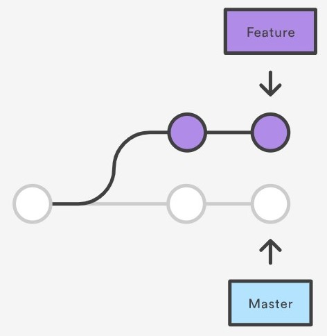
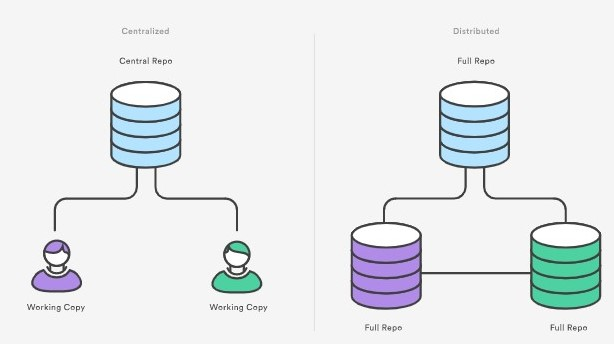
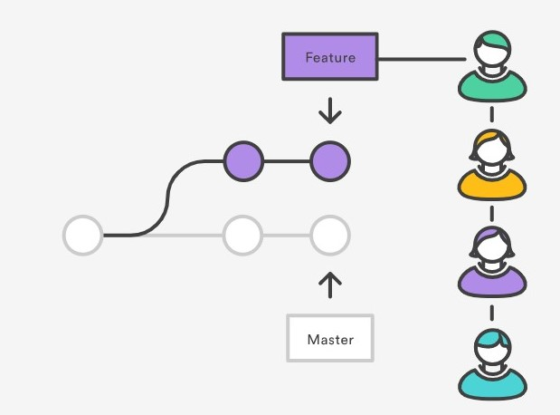
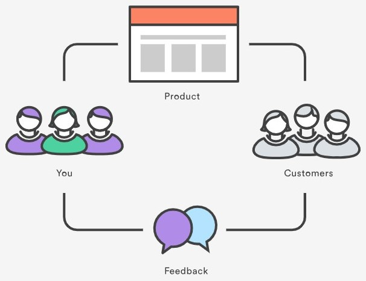
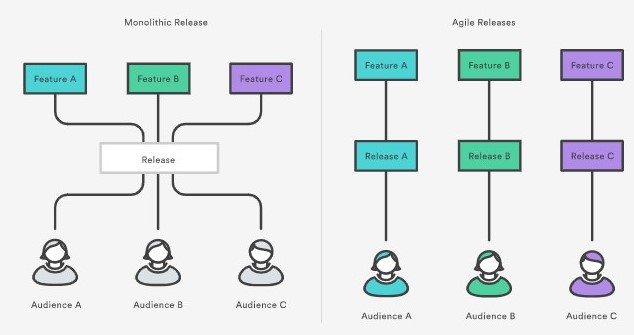

# IS601-MiniTeam1
This is the repository for the IS601 First Mini Team project.   

Team member:  
* Khang Tran
* Sahaj Vaidya  

In this project we will explain how the usage of Git, Docker, automated testing,
and continuous integration can improve the productivity and competitiveness of a company.

## 1. Git 

Git is a free and open source distributed version control system 
designed to handle everything from small to very large projects with 
speed and efficiency. Git’s purpose is to keep track of projects and files as they change over time with manipulations happening from different users. Git stores information about the project’s progress on a repository. 
A repository has commits to the project or a set of references to the commits called heads. 
All this information is stored in the same folder as the project in a sub-folder called .git and will mostly be hidden by default in most systems.  
So basically. Git keeps track of the changes a couple of people make on a single project and then merges the code where people have worked on different parts into one project. 
This way, when someone introduces a bug, you can track down the code that introduced the bug by going through the commits.

## 2. The Advantages of Git that can improve the productivity and competitiveness of a company.
### 2.1 Git for developers
#### 2.1.1 Branching
One of the biggest advantages of Git is its branching capabilities.
Feature branches provide an isolated environment for every change to your codebase.
When a developer wants to start working on something—no matter how big or small—they create a new branch. 
This ensures that the master branch always contains production-quality code.  
  
  

Using feature branches is not only more reliable than directly editing production code, 
but it also provides organizational benefits. 
They let you represent development work at the same granularity as the your agile backlog. 

#### 2.1.2 Distributed Development
Git is a distributed version control system. 
Instead of a working copy, each developer gets their own local repository, complete with a full history of commits.  
  
  
  
  
Having a full local history makes Git fast, since it means you don’t need a network connection to create commits, inspect previous versions of a file, or perform diffs between commits.
Distributed development also makes it easier to scale your engineering team. If someone breaks the production branch in SVN, other developers can’t check in their changes until it’s fixed. With Git, this kind of blocking doesn’t exist. Everybody can continue going about their business in their own local repositories.
And, similar to feature branches, distributed development creates a more reliable environment. Even if a developer obliterates their own repository, they can simply clone someone else’s and start anew.

#### 2.1.3 Pull Request
A pull request is a way to ask another developer to merge one of your branches into their repository. This not only makes it easier for project leads to keep track of changes, but also lets developers initiate discussions around their work before integrating it with the rest of the codebase.
Since they’re essentially a comment thread attached to a feature branch, pull requests are extremely versatile. When a developer gets stuck with a hard problem, they can open a pull request to ask for help from the rest of the team. Alternatively, junior developers can be confident that they aren’t destroying the entire project by treating pull requests as a formal code review.  
   
  
#### 2.1.4 Community
In many circles, Git has come to be the expected version control system for new projects. If your team is using Git, odds are you won’t have to train new hires on your workflow, because they’ll already be familiar with distributed development.
In addition, Git is very popular among open source projects. This means it’s easy to leverage 3rd-party libraries and encourage others to fork your own open source code.  
  

#### 2.1.5 Faster Release Cycle
The ultimate result of feature branches, distributed development, pull requests, and a stable community is a faster release cycle. These capabilities facilitate an agile workflow where developers are encouraged to share smaller changes more frequently. In turn, changes can get pushed down the deployment pipeline faster than the monolithic releases common with centralized version control systems.
As you might expect, Git works very well with continuous integration and continuous delivery environments. Git hooks allow you to run scripts when certain events occur inside of a repository, which lets you automate deployment to your heart’s content. You can even build or deploy code from specific branches to different servers.  
  

### 2.2 Git for Marketing
The shorter development cycle facilitated by Git makes it much easier to divide marketing task into individual releases. 
This gives marketers more to talk about, more often. In the above scenario, marketing can build out three campaigns that revolve around each feature, and thus target very specific market segments.  
  
  

For instance, they might prepare a big PR push for the game changing feature, a corporate blog post and newsletter blurb for Mary’s feature, and some guest posts about Rick’s underlying UX theory for sending to external design blogs. All of these activities can be synchronized with a separate release.  

